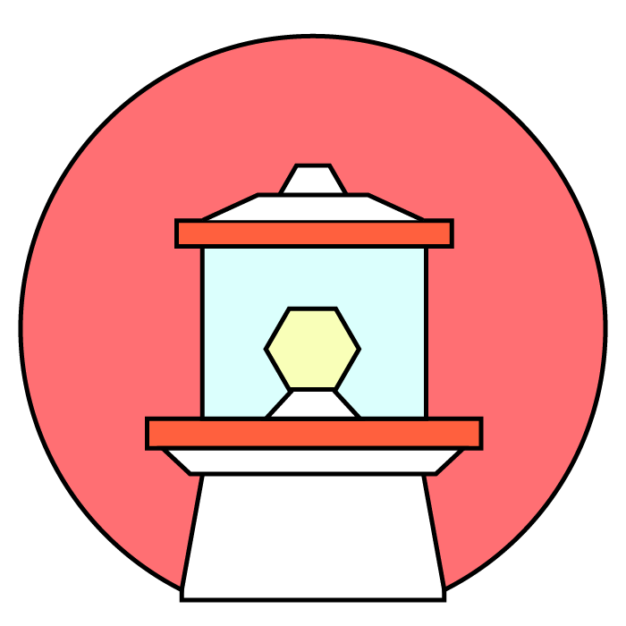

<p align="center"></p>
# Lighthouse

Smart lights control tool and `Rust` crate.

Currently it mainly supports Philips Hue lights. But the back-end crate is
written in a way that allows other smart lights to be added in the future.

## Installation

As it is under development you will need the `Rust` and `cargo` installed.
Easiest way to do so is to get on board with [rustup](https://rustup.rs).

Once you have the dependencies installed run:

```shell
cargo install --git https://github.com/finnkauski/lighthouse
```

More manually:

```shell
git clone https://github.com/finnkauski/lighthouse
cd lighthouse
cargo install --path .
```

## Usage

After installing you can use the tool as follows:

```shell
# turns all lights on
lh on

# turns all lights off
lh off

# send a state from text string
lh state

# send state from a json file, ignores text string passed
lh state -f filename
```

## Short-term trajectory

- Get the CLI to be a bit more comprehensive
- Add sending commands to lights by ID or Name
- Add color sending support
